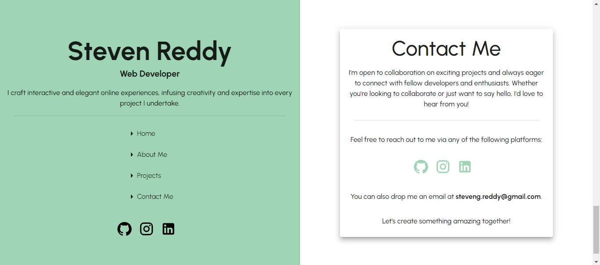

[](https://app.netlify.com/sites/steven-reddy/deploys)

# Portfolio

This is my personal portfolio website, showing of my skills and projects i've created.

## Problem Description
Before creating my portfolio, I faced challenges in effectively showcasing my projects and attracting attention from potential clients and employers. I realized the importance of having a dedicated portfolio to establish my online presence and demonstrate my capabilities in web development.

## Solution Approach
To address these challenges, I decided to build my portfolio using React and MUI (Material-UI). Leveraging these technologies allowed me to create a modern, device-friendly website while expanding my skill set. By using React, I could build a dynamic and interactive user interface, while MUI provided pre-designed components for a sleek and professional look.

Throughout the development process, I focused on simplicity, usability, and performance to ensure a seamless user experience. I also embraced the opportunity to learn and grow as a developer, overcoming challenges and refining my skills along the way.

## Model
### index
| Desktop              | Mobile         |
| ------------------------ | ---------------------- |
|  | 

The cornerstone of this website is its prominent side drawer, crafted using MUI's responsive drawer component. Occupying half the view width, it ensures that essential details like my name and contact information remain readily accessible as visitors explore the site. By seamlessly integrating a retractable nav bar, usability is enhanced, particularly for users on various devices.

To maintain a minimalistic design and prioritize performance, I've implemented scrolling links using React-Scroll. This not only keeps the website lightweight but also ensures quick loading and seamless browsing experiences for visitors. Additionally, I've made great use of MUI's extensive collection of icons to enrich the visual appeal and functionality of the website, enhancing its overall user experience.

### About Me
| Desktop              | Mobile         |
| ------------------------ | ---------------------- |
|  | 

To ensure a straightforward and engaging experience, I've designed this page to be concise yet informative, highlighting my previous experience while keeping users engaged.

Utilizing the MUI Button component, I've seamlessly integrated a link to my up-to-date resume hosted on Google Docs. This allows potential clients or employers to effortlessly view and download my PDF resume, ensuring accessibility and convenience.

For the website's font, I've opted for "Urbanist" from Google Fonts, leveraging its versatility and aesthetic appeal. By incorporating it using the createTheme import, I've ensured a consistent and visually pleasing typography throughout the website.

### Projects
| Desktop              | Mobile         |
| ------------------------ | ---------------------- |
|  | 

For the Projects section, my goal was to ensure flexibility for adding future projects seamlessly while also enabling individual project visibility. To achieve this, I implemented an array to store project data, including titles and GitHub URLs. By dynamically mapping over this array, each project is displayed within its own MUI Card, providing a clean and organized presentation.

Leveraging the capabilities of the MUI Card component, I applied styling to enhance the visual appeal and functionality of each project card. One key feature I integrated was the display of project languages. Utilizing additional Card functionalities, I incorporated a dropdown mechanism to expand the card, revealing the languages used for both front-end and back-end development. This allows visitors to gain insight into the technologies employed for each project.

### Contact Me
| Desktop              | Mobile         |
| ------------------------ | ---------------------- |
|  | 

Continuing with the theme of simplicity, I utilized the MUI Card component to elegantly display my contact information and express my openness to collaboration. By leveraging the intuitive layout of the card, I ensured that users can easily locate and engage with my contact details.

To maintain accessibility, I strategically placed social icons within proximity to my contact information, ensuring quick access for visitors interested in connecting through various channels.

This approach prioritizes readability and showcases my skills in an organized and visually pleasing manner. By presenting information in an ordered layout, I aim to provide visitors with a seamless and enjoyable browsing experience

## Problems encountered

- Getting to grips with MUI and the shorthand syntax.
- The importance of checking device usability. 
- The structure of a react application.
- setting up and correctly applying a MUI theme.

## New skills

- Having a better understanding with React and the use of Hooks and useState
- The correct uses of vh and vw to make the site more user friendly.
- How to use sx inside a component.
- Deploying the application.
- Creating and implementing a Favicon.

## languages
- HTML
- CSS
- JavaScript (JSX)
- React
- Frameworks
    - MUI
    - Vite 

## Running Locally

### Running Web Page

Ensure you have the following prerequisites installed on your system:

- Node.js and npm (Node Package Manager)
- Git

Clone the repository:
```
git clone https://github.com/SReddy-96/Portfolio
```
Navigate into directory:
```
cd Portfolio
```
Install Dependencies:
```
npm install
```
Run the Application in development mode: 
```
npm run dev
```

Explore the Application:
- You can now explore the various features and functionalities of the web application.
